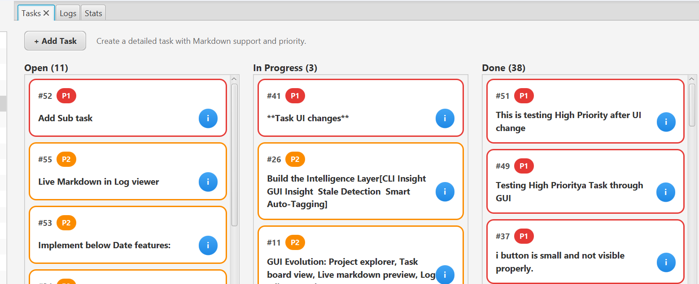
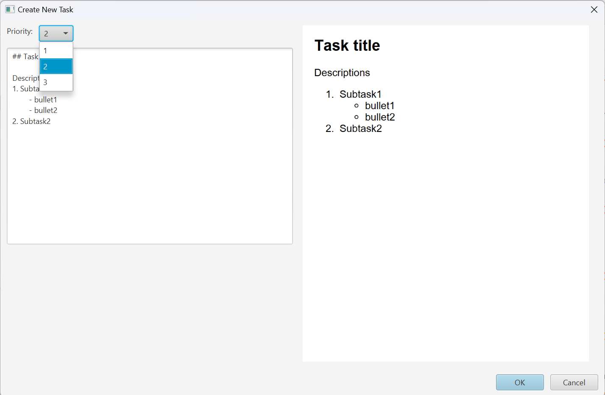
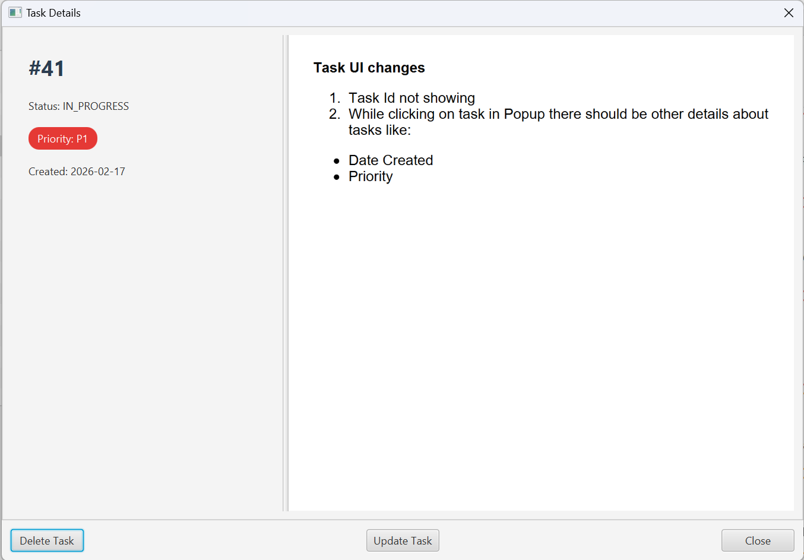
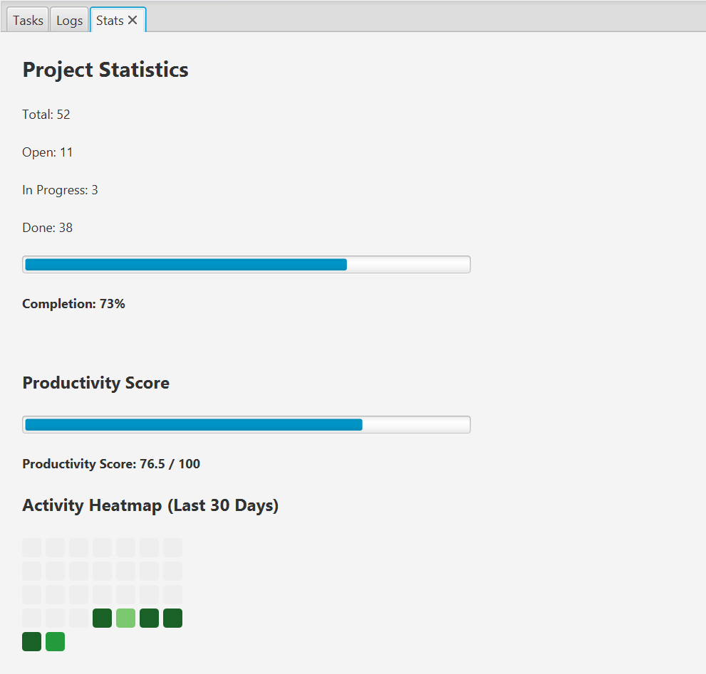
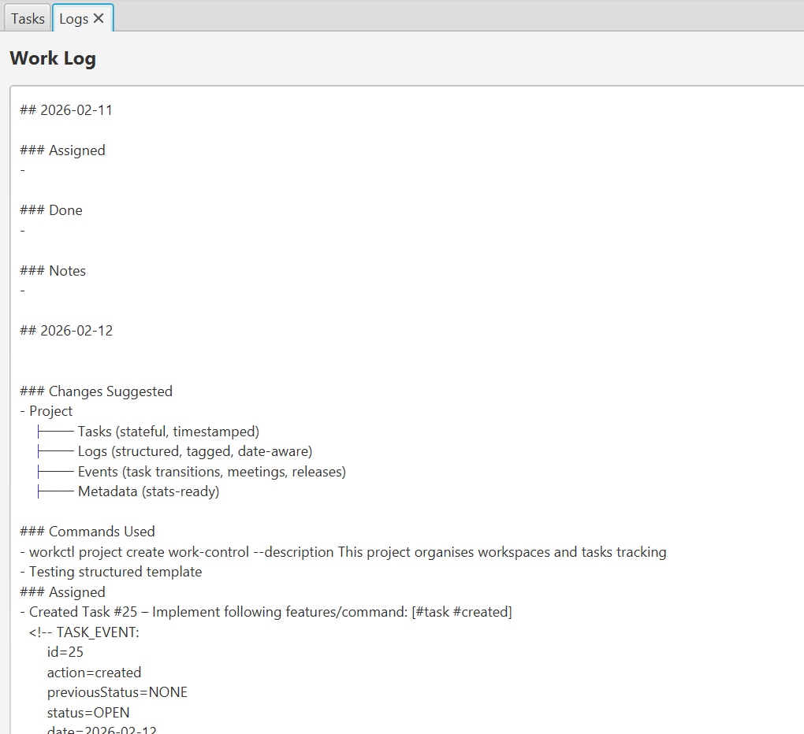

# workctl

A hybrid CLI + GUI developer productivity system built in Java.

Workctl combines structured Markdown storage, Kanban task tracking, logging intelligence, and project workspace management — all filesystem-backed and version-control friendly.

## What Workctl Is Now

Workctl is no longer just a logging CLI.

It is a:

- 📁 Project workspace manager

- 📝 Structured Markdown task engine

- 📊 Kanban board with drag & drop

- 🎯 Priority-driven task system

- 📅 Date-aware metadata tracker

- 🖥 JavaFX desktop app

- ⚙ CLI-first automation tool

- 📂 Git-friendly filesystem database

## Project Structure

This is a Gradle multi-module project with the following modules:

```java
workctl/
│
├── core/      → Business logic (tasks, logs, stats, parsing engine)
├── cli/       → Command-line interface (Picocli)
├── gui/       → JavaFX desktop application
├── config/    → YAML config management
```
### Layered Design

```bash
CLI ───────┐
│
GUI ───────┼──► Core Services ─► Markdown Engine ─► Filesystem
│
Config ────┘
```

## Building

```bash
./gradlew build
```

## Running

### CLI

```bash
./gradlew :cli:installDist
./gradlew clean :cli:installDist
```

### GUI

```bash
./gradlew gui:run
./gradlew clean :gui:run
```

## Configuration

Configuration is stored at `~/.workctl/config.yaml`

Default configuration:

```yaml
workspace: "C:/Users/Ajay/Work"
editor: "code"
dateFormat: "yyyy-MM-dd"
```


## Workctl Project Architecture & System Design

### Project Overview

Workctl is a cross-platform Java CLI (with GUI support) designed to:

- Organize project workspaces
- Track daily work logs
- Structure notes in Markdown
- Enable smart date-aware logging
- Prepare for reporting automation (weekly summaries etc.)

It is built using:

- Java 17+
- Gradle (multi-module)
- Picocli (CLI framework)
- SnakeYAML (configuration)
- JavaFX 21 (GUI module)
- CommonMark (Markdown parsing + preview)
- Filesystem-backed storage (no DB)

### High-Level Architecture

```java
        ┌────────────────────┐
        │      CLI Layer     │
        │      (Picocli)     │
        └──────────┬─────────┘
        │
        ┌──────────▼─────────┐
        │       GUI Layer     │
        │     (JavaFX UI)     │
        └──────────┬─────────┘
        │
        ┌──────────▼─────────┐
        │      Core Layer     │
        │  TaskService, Log   │
        │  StatsService       │
        └──────────┬─────────┘
        │
        ┌──────────▼─────────┐
        │  Markdown Engine    │
        │  Metadata Parser    │
        └──────────┬─────────┘
        │
        ┌──────────▼─────────┐
        │   Filesystem I/O    │
        │  tasks.md storage   │
        └────────────────────┘

```

#### Responsibilities

| Module | Responsibility |
|---------|----------------|
| CLI     | Parse arguments, call core services |
| Core    | Project creation, logging logic |
| Config  | Load/save workspace configuration |
| GUI     | Desktop interface using same services |

### Workspace Structure

After workctl init:

```bash
Workspace/
│
└── 01_Projects/
    └── <project-name>/
        ├── README.md
        ├── docs/
        ├── src/
        ├── logs/
        └── notes/
            └── work-log.md
            └── tasks.md

```

## Task Engine (Major Feature)

Tasks are stored in structured Markdown:

```markdown
## Open

12. [ ] (P1) Implement Kanban drag drop
    <!-- META: created=2026-02-16 -->

## In Progress
```

Each task supports:

- ID
- Status (Open / In Progress / Done)
- Priority (P1 / P2 / P3)
- Created Date
- Multiline description
- Metadata comment block

## Supported CLI Commands

```bash
workctl init
workctl project create <path>

workctl project create
workctl project create <project-name> --description "text"
workctl project list

workctl task add <project>
workctl task add <project> --edit
workctl task add <project> --file task.txt
workctl task add <project> -p 1
workctl task list <project>
workctl task start <project> <task-id>
workctl task done <project> <task-id>
workctl task show <project> <task-id>
workctl task delete <project> -id 12

workctl log <project>   // Interactive Mode
workctl log <project> --section <section>
workctl log <project> --message "text"
workctl log <project> --section done --edit   // Editor Mode

workctl weekly
workctl weekly <project>
workctl weekly <project> --from 2026-02-11 --to 2026-02-14

workctl search <keyword>
workctl search <tag> --tag

workctl insight <project>

workctl config show
workctl config set editor <name>
workctl config set workspace <path>

```

### [For more on CLI API guide Refer -> CLI APIs](docs/cli-api_updated.md)

## GUI Features

### Kanban Board

- Drag & Drop across columns

- Priority-based sorting

- Colored borders per priority

- Stable ID + Priority display

- Hover highlight

### Inline Editing

- Double click → edit

- Enter → save

- Shift+Enter → new line

- Esc → cancel

- Single click → highlight

- Right click → context menu

### Priority Engine

- Set priority on creation

- Change via context menu

- Sorted by priority automatically

- Visual badge per task

### Task Details View

**Split View:**

Left:

- ID

- Status

- Priority

- Created Date

Right:

- Markdown rendered description (scrollable)

Includes:

- Update Task button

- Delete Task button

- Copyable text

- Scrollable content

## Markdown Support

- Live preview in Add Task dialog

- CommonMark engine

- GFM table extension

- Metadata stored in HTML comments

- Git-friendly format

## Logging Engine

- Smart logging system:

- Detects date blocks

- Auto-creates missing date sections

- Structured categories:

    - Assigned
    - Done
    - Notes
    - Commands Used

- Prevents duplicate headers

## CLI–GUI Parity

All task operations supported in:

- CLI

- GUI

- Shared core logic

Single source of truth:

```java
TaskService (core module)
```

## Screenshots

### GUI Usage











### CLI Usage


### AI Agent


#### You can also refer [Sample AI Agent Response](docs/ai-weekly-resp.md).


## Design Philosophy

- Filesystem as database

- Markdown-first persistence

- Zero external DB dependency

- Git compatible storage

- Clear separation of concerns

- CLI-first, GUI-enhanced

- Extensible architecture

## Internal Design Highlights

### Task Parsing Engine

- Regex-based Markdown parsing

- Metadata extraction

- Backward compatibility support

- Safe defaults for missing fields

### Status Transition Engine

- Automatic logging on state change

- Intelligent stale detection (future-ready)

- Extensible state machine

## What Makes This Unique

Unlike typical task managers:

- No hidden DB

- Fully Git versionable

- CLI automation friendly

- Structured Markdown

- Developer-centric workflow

- Hybrid productivity system

## 👨‍💻 Author

Built as part of an evolving Developer Productivity System.