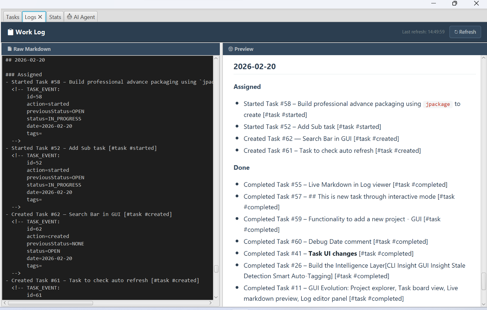
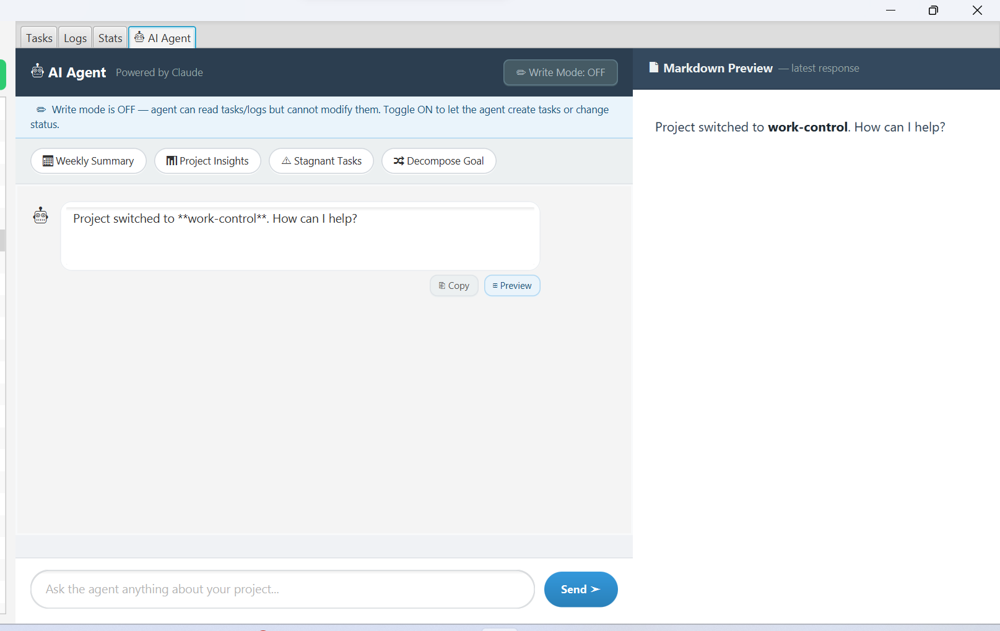
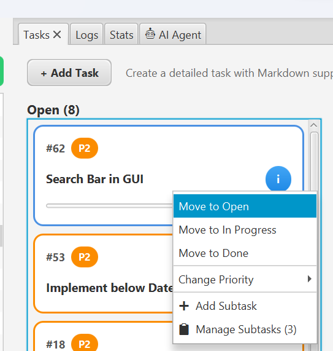
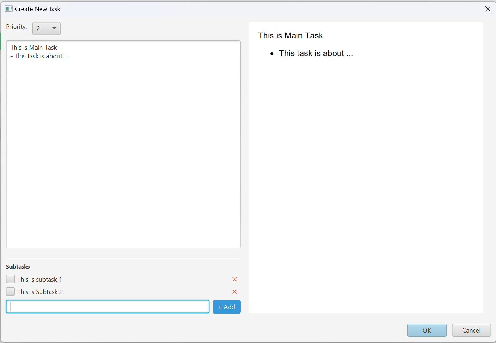
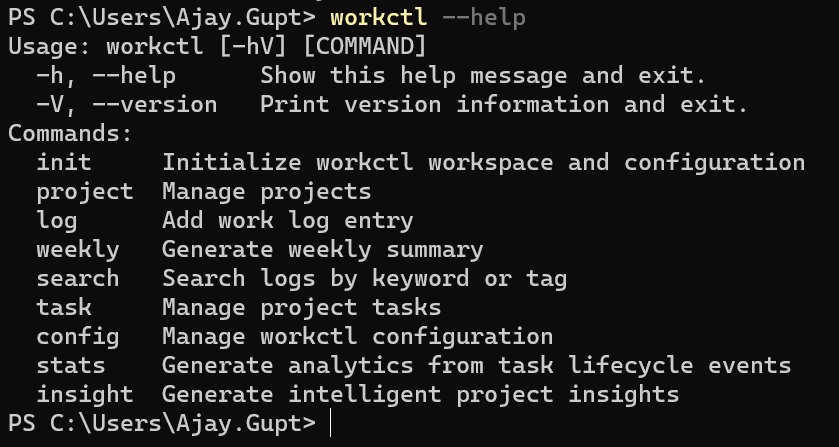
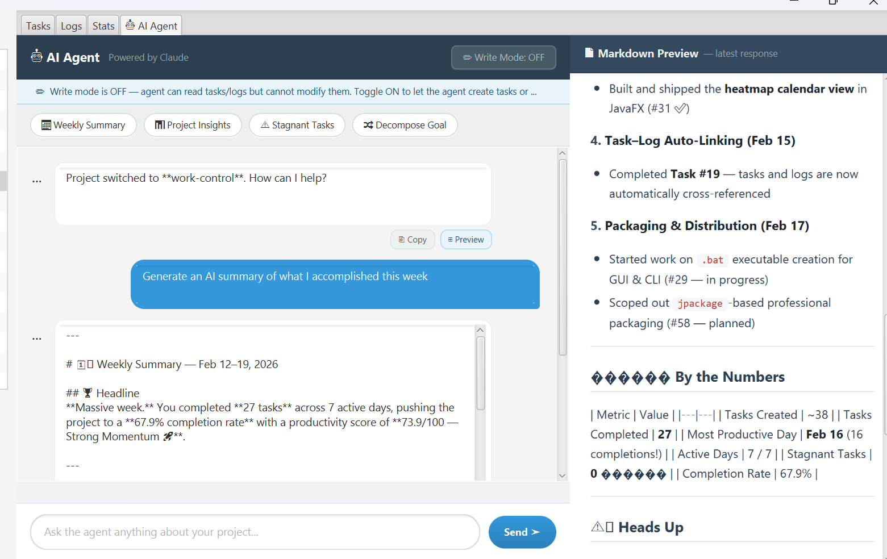
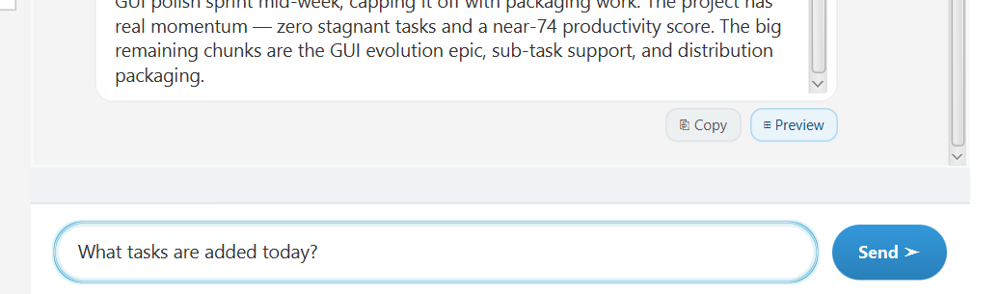
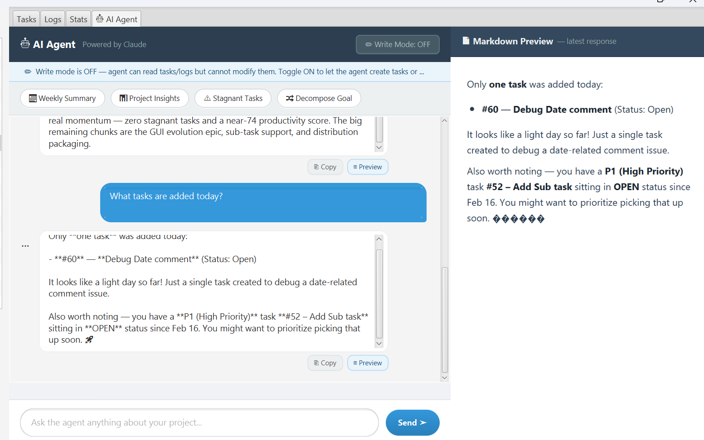

# workctl

**v2.0.0** · A hybrid CLI + GUI developer productivity system built in Java.

Workctl helps developers manage projects, track tasks, document procedures, log work, run AI-assisted analysis, and build a personal command reference — all stored as plain Markdown files on your filesystem. No database. No cloud dependency. Fully Git-versionable.

---

## What Workctl Is

| Capability | Description |
| --- | --- |
| **Task Kanban** | Open → In Progress → Done board with priorities, subtasks, and drag & drop |
| **Work Logging** | Structured daily logs with sections (Assigned, Done, Notes, Commands) |
| **Command Library** | Personal searchable reference for Linux, Docker, Git, and any CLI commands |
| **Workflows** | Reusable step-by-step procedure templates with per-run execution tracking |
| **Meetings** | Meeting notes creation and management per project |
| **Interviews** | Interview tracking with questions, ratings, and outcomes |
| **Weekly Reports** | Auto-generated summaries across a date range |
| **Stats & Insights** | Productivity score, completion rates, stagnation detection |
| **AI Agent** | Claude-powered assistant embedded in both CLI and GUI (read + write modes) |
| **CLI-first** | Every operation works from the terminal; GUI enhances but never requires it |
| **Filesystem storage** | All data lives in `.md` files — human-readable and Git-friendly |

---

## Documentation

| Guide | What it covers |
| --- | --- |
| [Quick Setup →](docs/SETUP.md) | Prerequisites, install, init workspace, PATH config |
| [CLI Reference →](docs/cli-api.md) | Every command, flag, and option with examples |
| [Workflows Guide →](docs/workflows-guide.md) | Templates, runs, step tracking (CLI + GUI) |
| [Distribution Guide →](docs/DISTRIBUTION_GUIDE.md) | Build, package, and distribute workctl |
| [Full Technical Reference →](docs/workctl-docs.md) | Architecture, data formats, module internals |

---

## Getting Started

New to workctl? Start here: **[docs/SETUP.md](docs/SETUP.md)**

Covers prerequisites, PATH setup, workspace initialization, and your first project.

### Quick Install (no Java needed)

Download from the **[Releases page →](https://github.com/Ajay3007/workctl/releases/tag/v2.0.0)**

| Platform | GUI | CLI |
| --- | --- | --- |
| **Windows** | `workctl-gui-2.0.0-windows.zip` | `workctl-2.0.0-windows.zip` |
| **macOS (Apple Silicon)** | `workctl-gui-2.0.0-macos.zip` | `workctl-2.0.0-macos.zip` |
| **Linux** | `workctl-gui-2.0.0-linux.zip` | `workctl-2.0.0-linux.zip` |

**Windows:** Unzip → double-click `workctl-gui.exe`. If SmartScreen warns, click **More info → Run anyway**.
**macOS:** Unzip → right-click `workctl-gui.app` → **Open**. Or: `xattr -dr com.apple.quarantine workctl-gui.app && open workctl-gui.app`
**Linux:** Unzip → `chmod +x workctl && ./workctl`

### Build from Source

```bash
# Build everything
./gradlew clean build

# Run CLI
./gradlew :cli:installDist
./cli/build/install/cli/bin/cli <command>

# Run GUI
./gradlew :gui:run
```

### First-Time Setup

```bash
# 1. Initialize workspace
workctl init --workspace /path/to/workspace

# 2. Set API key for AI features (optional)
workctl config set anthropicApiKey sk-ant-...

# 3. Create a project
workctl project create my-project --description "My first project"

# 4. Add a task
workctl task add my-project "Set up development environment" -p 1

# 5. Start working
workctl task list my-project
```

---

## CLI Quick Reference

Full reference: **[docs/cli-api.md](docs/cli-api.md)**

```bash
# ── Workspace & Projects ─────────────────────────────────────────────
workctl init --workspace <path>
workctl project create <name> --description "text"
workctl project list

# ── Tasks ────────────────────────────────────────────────────────────
workctl task add <project> "Task title" -p 1          # P1=high, P2=med, P3=low
workctl task list <project>
workctl task start <project> <id>
workctl task done <project> <id>
workctl task show <project> <id>
workctl task delete <project> -id <id>

# ── Subtasks ─────────────────────────────────────────────────────────
workctl task subtask add <project> <task-id> "Subtask title"
workctl task subtask list <project> <task-id>
workctl task subtask done <project> <task-id> <index>
workctl task subtask delete <project> <task-id> <index>

# ── Work Logging ─────────────────────────────────────────────────────
workctl log <project> --message "Deployed auth service"
workctl log <project> --section done --message "Completed API integration"

# ── Workflows ────────────────────────────────────────────────────────
workctl flow template new "Release Checklist" --tags "release"
workctl flow template step-add <template-id> "Run all tests" --expected "All green"
workctl flow template list
workctl flow new "Release v1.3.0" --template <id> --project my-project
workctl flow list --project my-project
workctl flow show <run-id>
workctl flow step done <run-id> 1
workctl flow step note <run-id> 1 --message "All 47 tests passed"
workctl flow step skip <run-id> 2

# ── Reports & Search ─────────────────────────────────────────────────
workctl weekly <project>
workctl weekly <project> --from 2026-02-11 --to 2026-02-17
workctl search <keyword>
workctl stats <project>
workctl insight <project>

# ── Command Library ───────────────────────────────────────────────────
workctl cmd add docker "docker ps -a" -t "List all containers"
workctl cmd list
workctl cmd list <category>
workctl cmd search "<keyword>"

# ── Meetings ─────────────────────────────────────────────────────────
workctl meeting <project> "Sprint Planning"

# ── AI Agent ─────────────────────────────────────────────────────────
workctl ask <project> "What did I work on this week?"
workctl ask <project> --act "Break this goal into tasks"
workctl ask <project> --weekly
workctl ask <project> --insight

# ── Config ───────────────────────────────────────────────────────────
workctl config show
workctl config set workspace <path>
workctl config set editor code
workctl config set anthropicApiKey sk-ant-...
```

---

## GUI Overview

Launch with `./gradlew :gui:run` or double-click `workctl-gui.exe`.

The GUI has a **project sidebar** on the left and **nine tabs** on the right — all sharing the selected project context.

### Tabs at a Glance

| Tab | What you do there |
| --- | --- |
| **Tasks** | Kanban board — drag cards between Open / In Progress / Done; add tasks with Markdown descriptions and subtasks |
| **Commands** | Browse and copy your command library; filter by category or project scope |
| **Logs** | Read-only view of the current project's `work-log.md` |
| **Stats** | Productivity score, completion rate, stagnation alerts, 30-day activity heatmap |
| **Meetings** | Create and browse meeting notes for the selected project |
| **Interview** | Track interviews with questions, candidate ratings, and outcomes |
| **Workflows** | Manage reusable templates and track named procedure runs step-by-step |
| **Weekly Report** | Generate and view weekly summaries for a date range |
| **AI Agent** | Chat with Claude about your project — read-only or write mode |

### Tasks Tab (Kanban)

- Three columns: Open · In Progress · Done
- Drag & drop cards between columns
- Priority-based sorting (P1 first), color-coded borders
- Live subtask progress bar per card
- Right-click context menu: move status, change priority, add/manage subtasks
- Double-click card: inline edit
- Click `ⓘ`: full details popup with Markdown preview

### Commands Tab

- Categories shown as a sidebar list (one `.md` file per category)
- Scope filter: `GLOBAL`, project-specific, or all
- One-click copy to clipboard
- Add/edit/delete commands via dialog
- Auto-populated with useful defaults on first run

### Workflows Tab

- Left panel: filter by scope/template, list of runs, + New Run, Manage Templates
- Right panel: selected run with step cards
- Each step card: status icon, title, ✓ Done / → Skip / + Note / ↑ ↓ × buttons
- Expandable step detail: guidance, notes, expected vs. actual result, code blocks
- Sync button (template-based runs): pulls latest template changes without overwriting your progress

### AI Agent Tab

| Mode | Button | What the agent can do |
| --- | --- | --- |
| Read-only (default) | grey | Answer questions, search logs, analyse stats |
| Write mode | orange | Also create tasks, move task status |

Quick-action buttons: **Weekly Summary · Project Insights · Stagnant Tasks · Decompose Goal**

---

## Workspace Layout

```text
<workspace>/
├── 00_Inbox/                        ← Unprocessed items
├── 01_Projects/
│   └── <project-name>/
│       ├── README.md
│       ├── notes/
│       │   ├── tasks.md             ← Kanban source of truth
│       │   └── work-log.md          ← Daily structured log
│       ├── meetings/                ← Meeting notes
│       └── workflows/               ← Project-scoped workflow runs
├── 02_Commands/                     ← Command library (one .md per category)
│   ├── docker.md
│   ├── git.md
│   ├── linux.md
│   └── ...
├── 03_Meetings/                     ← Global meeting notes
├── 04_References/                   ← Reference documents
├── 06_Workflows/
│   ├── templates/                   ← Reusable procedure blueprints
│   └── runs/                        ← Global workflow runs
└── 99_Archive/                      ← Archived projects
```

---

## Configuration

Stored at `~/.workctl/config.yaml`:

```yaml
workspace: "/path/to/your/workspace"
editor: "code"
dateFormat: "yyyy-MM-dd"
anthropicApiKey: "sk-ant-..."        # required for AI agent features
```

```bash
workctl config set workspace /path/to/workspace
workctl config set editor code
workctl config set anthropicApiKey sk-ant-YOUR_KEY
```

---

## Module Structure

Gradle multi-module project with one-way dependency flow:

```text
cli  ─┐
gui  ─┼──► core ──► config
agent─┘
```

| Module | Purpose |
| --- | --- |
| `core` | All business logic and Markdown-based persistence. No UI dependency. |
| `cli` | Picocli commands. Entry point: `WorkctlCLI.java`. |
| `gui` | JavaFX 21 desktop application. Entry point: `WorkctlApp.java`. |
| `agent` | Claude API integration with multi-turn tool-use loop. |
| `config` | YAML config loading from `~/.workctl/config.yaml`. |

Full architecture details: **[docs/workctl-docs.md](docs/workctl-docs.md)**

---

## Design Philosophy

- **Filesystem as database** — no hidden DB, no migrations, no lock-in
- **Markdown-first** — human-readable, Git-versionable, editor-friendly
- **CLI-first, GUI-enhanced** — every operation works in both interfaces
- **AI as an extension** — the agent calls the same Core services as the CLI/GUI
- **Clear separation** — Core is independent of CLI, GUI, and Agent

---

## Tech Stack

| Component | Technology |
| --- | --- |
| Language | Java 17+ |
| Build | Gradle (multi-module) |
| CLI | Picocli |
| GUI | JavaFX 21 |
| Config | SnakeYAML |
| Markdown | CommonMark (`org.commonmark`) |
| AI | Anthropic Claude API (HTTP, tool-use loop) |
| JSON | Jackson |
| Storage | Plain Markdown files |

---

## Screenshots

### GUI










### CLI




### AI Agent





See also: [Sample AI Agent Response](docs/ai-weekly-resp.md)

---

## Author

Ajay Gupt

Built as part of an evolving Developer Productivity System.
