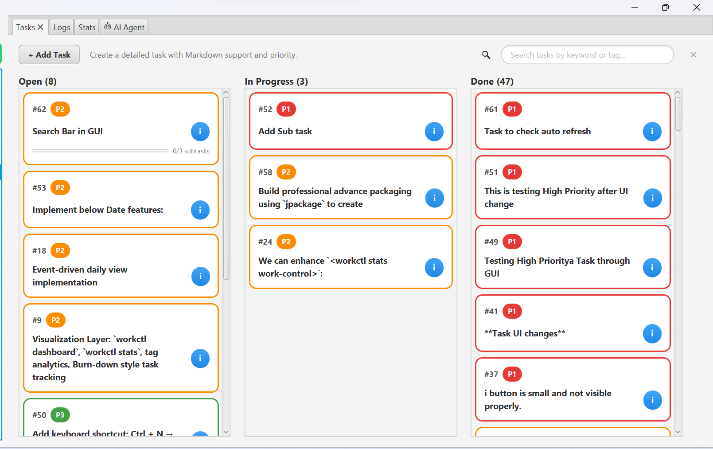
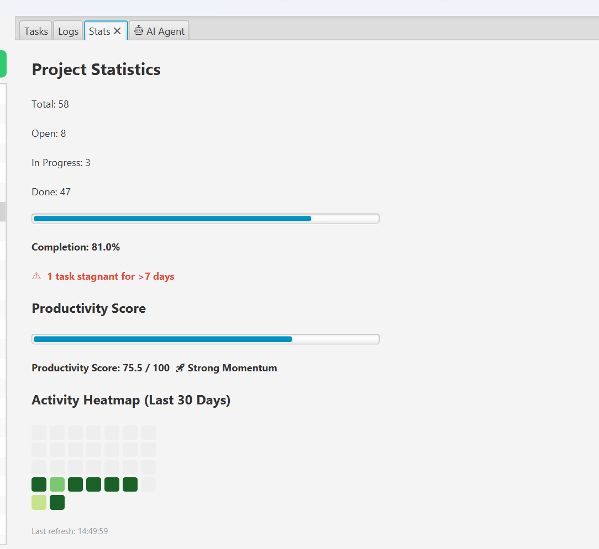
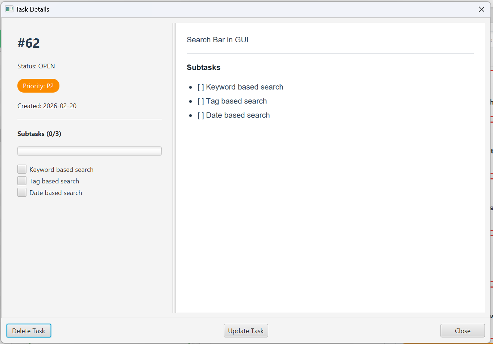
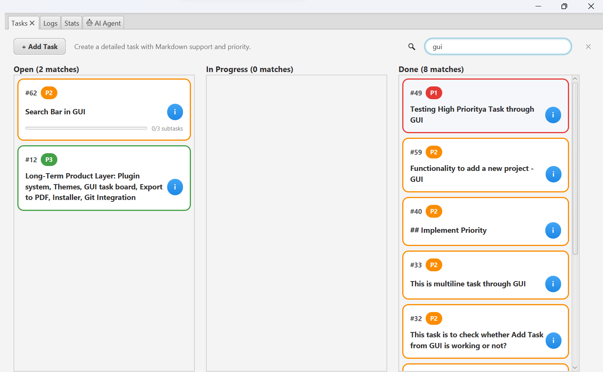

# workctl

A hybrid CLI + GUI developer productivity system built in Java.

Workctl combines structured Markdown storage, Kanban task tracking, subtask management, AI-powered assistance, and project workspace management — all filesystem-backed and version-control friendly.

---

## What Workctl Is

- 📁 Project workspace manager
- 📝 Structured Markdown task engine
- ✅ Hierarchical task + subtask system
- 📊 Kanban board with drag & drop
- 🎯 Priority-driven task system
- 📅 Date-aware metadata tracker
- 🔍 Full-text task search
- 🤖 AI agent powered by Claude (read + write modes)
- 🖥 JavaFX desktop application
- ⚙ CLI-first automation tool
- 📂 Git-friendly filesystem database

---

## Project Structure

Gradle multi-module project:

```
workctl/
│
├── core/      → Business logic (tasks, subtasks, logs, stats, parsing engine)
├── cli/       → Command-line interface (Picocli)
├── gui/       → JavaFX desktop application
├── config/    → YAML config management
└── agent/     → AI agent module (Claude API, tool loop, context builder)
```

### Layered Design

```
CLI  ──────────┐
               │
GUI  ──────────┼──► Core Services ─► Markdown Engine ─► Filesystem
               │
Agent ─────────┘
```

---

## Building

```bash
./gradlew clean build
```

## Running

### CLI

```bash
./gradlew :cli:installDist
./gradlew clean :cli:installDist
```

### GUI

```bash
./gradlew gui:run
./gradlew clean :gui:run
```

---

## Configuration

Stored at `~/.workctl/config.yaml`:

```yaml
workspace: "C:/Users/Ajay/Work"
editor: "code"
dateFormat: "yyyy-MM-dd"
anthropicApiKey: "sk-ant-..."   # required for AI agent
```

Set values via:

```bash
workctl config set anthropicApiKey sk-ant-YOUR_KEY
workctl config set workspace /path/to/workspace
workctl config set editor code
```

---

## Workspace Structure

```
Workspace/
└── 01_Projects/
    └── <project-name>/
        ├── README.md
        ├── docs/
        ├── src/
        ├── logs/
        └── notes/
            ├── work-log.md
            └── tasks.md
```

---

## Task Engine

Tasks are stored in structured Markdown with full subtask support:

```markdown
## Open

1. [ ] (P1) Implement search bar  <!-- created=2026-02-20 -->
    Full description of the task here.
    - [ ] Keyword-based search
    - [x] Tag-based search
    - [ ] Date-based search

## In Progress

2. [~] (P2) Refactor parser  <!-- created=2026-02-18 -->

## Done

3. [x] (P3) Update README  <!-- created=2026-02-15 -->
```

Each task supports:

- Unique ID
- Status: Open / In Progress / Done
- Priority: P1 (High) / P2 (Medium) / P3 (Low)
- Created date
- Multiline Markdown description
- Subtask list with individual done/open state
- Metadata stored in HTML comments (invisible in rendered Markdown)

---

## Supported CLI Commands

```bash
# Workspace
workctl init
workctl project create <project-name> --description "text"
workctl project list

# Tasks
workctl task add <project>
workctl task add <project> --edit
workctl task add <project> --file task.txt
workctl task add <project> -p 1
workctl task list <project>
workctl task start <project> <task-id>
workctl task done <project> <task-id>
workctl task show <project> <task-id>
workctl task delete <project> -id 12

# Work Logging
workctl log <project>
workctl log <project> --section <section>
workctl log <project> --message "text"
workctl log <project> --section done --edit

# Reports
workctl weekly
workctl weekly <project>
workctl weekly <project> --from 2026-02-11 --to 2026-02-14
workctl weekly <project> --ai                           # AI-generated narrative summary

# Search
workctl search <keyword>
workctl search <tag> --tag

# Insights
workctl insight <project>
workctl insight <project> --ai                          # AI-enhanced analysis

# AI Agent
workctl ask <project> "What did I work on this week?"
workctl ask <project> --act "Break this goal into tasks"

# Config
workctl config show
workctl config set editor <name>
workctl config set workspace <path>
workctl config set anthropicApiKey <key>
```

### [For more on CLI API guide Refer -> CLI APIs](docs/cli-api_updated.md)

---

## GUI Features

### Kanban Board

- Three columns: Open, In Progress, Done
- Drag & drop cards between columns
- Priority-based automatic sorting (P1 first)
- Color-coded borders per priority level (Red / Orange / Green)
- Live subtask progress bar on each card
- Task count per column

### Search Bar

- Live filtering as you type — no button press needed
- Searches across title, description, tags, and subtask titles
- Results stay grouped in their status columns
- Column headers show match count when filtering
- One-click clear button to reset

### Add / Update Task Dialog

- Markdown description editor with live preview (CommonMark)
- Priority dropdown (P1 / P2 / P3)
- Inline subtask panel: add, check/uncheck, delete subtasks before saving
- Update Task dialog includes the same subtask editor + live markdown preview + priority change

### Task Card Interactions

| Action | Result |
|---|---|
| Single click | Highlight card |
| Double click | Inline edit description |
| Click `i` button | Open full details popup |
| Right-click | Context menu |
| Drag | Move to another column |

### Context Menu (Right-click)

- Move to Open / In Progress / Done
- Change Priority (P1 / P2 / P3)
- ➕ Add Subtask — quick single-subtask dialog
- 📋 Manage Subtasks — full add / toggle / delete interface

### Task Details Popup (Split View)

Left panel:
- Task ID, Status, Priority badge, Created date
- Subtask checklist with progress bar — click to toggle done/undone

Right panel:
- Full Markdown rendered view including subtask checklist
- Text is selectable and copyable (right-click → Copy)
- Scrollable

Buttons: **Update Task** | **Delete Task** | **Close**

### Auto-Refresh

- Board auto-refreshes when `tasks.md` is modified externally (WatchService)
- Switching projects clears search and reloads board

---

## Subtask System

Subtasks are stored as 4-space-indented checkbox lines directly in `tasks.md`:

```
1. [ ] (P2) Build reporting feature  <!-- created=2026-02-20 -->
    Full description.
    - [ ] Design data model
    - [x] Implement parser
    - [ ] Write tests
```

**Operations available:**

| Operation | GUI | CLI | AI Agent |
|---|---|---|---|
| Add subtask | ✅ Add Task dialog, right-click, Update dialog | — | ✅ `add_subtask` tool |
| Toggle done/undone | ✅ Details popup checklist, Manage dialog | — | — |
| Delete subtask | ✅ Manage Subtasks dialog | — | — |
| View progress | ✅ Card progress bar + details popup | — | ✅ Context-aware |

---

## AI Agent

The agent integrates Claude via the Anthropic API with a full tool-use loop.

### Write Mode Toggle

In the GUI's Agent tab, toggle **Write Mode** to control what the agent can do:

| Mode | What the agent can do |
|---|---|
| **OFF** (default) | Read tasks, search logs, give insights — safe for questions |
| **ON** | Everything above + create tasks, add subtasks, move task status |

### Available Agent Tools

| Tool | Mode | Description |
|---|---|---|
| `list_tasks` | Read | List tasks filtered by status |
| `search_logs` | Read | Search work log entries by date range |
| `get_insights` | Read | Fetch project health statistics |
| `add_task` | Write | Create a new task with description and priority |
| `add_subtask` | Write | Add a subtask to an existing task by ID |
| `move_task` | Write | Change a task's status |

### Example Agent Interactions

```
"Which P1 tasks have been stuck for more than a week?"

"Summarize what I did this week."

"Break down 'Build the reporting dashboard' into tasks."
→ Agent creates tasks and adds subtasks for each one.

"Add a subtask 'Write unit tests' to task #42."

"Give me an AI analysis of this project's health."
```

### Specialized Agent Commands (GUI Quick Actions)

- **📅 Weekly Summary** — narrative summary of the week's work
- **📊 Project Insights** — AI interpretation of productivity stats
- **⚠ Stagnant Tasks** — highlights tasks stuck for 7+ days
- **🔀 Decompose Goal** — breaks a high-level goal into tasks and subtasks

---

## Markdown Support

- Live preview in Add Task and Update Task dialogs
- CommonMark engine (via `org.commonmark`)
- Subtasks rendered as GFM task-list checkboxes in preview
- Metadata stored in HTML comments — invisible when rendered
- All preview panels: text selectable, right-click → Copy
- Git-friendly plain-text storage format

---

## Logging Engine

- Smart date-block detection — auto-creates missing date sections
- Structured log categories: Assigned, Done, Notes, Commands Used
- Prevents duplicate section headers
- Metadata event tracking (task created / started / completed)
- Last 7 days included in AI agent context automatically

---

## High-Level Architecture

```java
        ┌────────────────────┐
        │      CLI Layer     │
        │      (Picocli)     │
        └──────────┬─────────┘
        │
        ┌──────────▼─────────┐
        │       GUI Layer     │
        │     (JavaFX UI)     │
        └──────────┬─────────┘
        │
        ┌──────────▼─────────┐
        │      Core Layer     │
        │  TaskService, Log   │
        │  StatsService       │
        └──────────┬─────────┘
        │
        ┌──────────▼─────────┐
        │  Markdown Engine    │
        │  Metadata Parser    │
        └──────────┬─────────┘
        │
        ┌──────────▼─────────┐
        │   Filesystem I/O    │
        │  tasks.md storage   │
        └────────────────────┘

```

### Responsibilities

| Module | Responsibility |
|---------|----------------|
| CLI     | Parse arguments, call core services |
| Core    | Project creation, logging logic |
| Config  | Load/save workspace configuration |
| GUI     | Desktop interface using same services |


## Screenshots

### GUI Usage












### CLI Usage


### AI Agent


#### You can also refer [Sample AI Agent Response](docs/ai-weekly-resp.md).


## Design Philosophy

- **Filesystem as database** — no hidden DB, no migrations
- **Markdown-first persistence** — human-readable, Git-versionable
- **Zero external DB dependency** — tasks.md is the source of truth
- **CLI-first, GUI-enhanced** — every operation works in both
- **AI as an extension, not a replacement** — agent calls the same Core services
- **Backward compatible** — old tasks.md files parse correctly
- **Clear separation of concerns** — Core is independent of CLI, GUI, and Agent

---

## Tech Stack

| Component | Technology |
|---|---|
| Language | Java 17+ |
| Build | Gradle (multi-module) |
| CLI framework | Picocli |
| GUI framework | JavaFX 21 |
| Config | SnakeYAML |
| Markdown | CommonMark (`org.commonmark`) |
| AI | Anthropic Claude API (HTTP, tool-use loop) |
| JSON | Jackson (`com.fasterxml.jackson`) |
| Storage | Plain Markdown files (filesystem) |

---

## Author

Built as part of an evolving Developer Productivity System.
